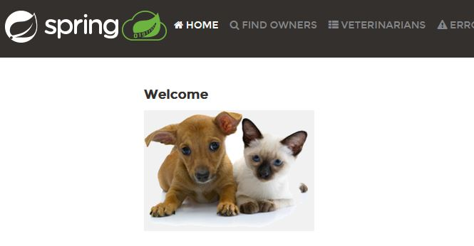

# Labo02 - Run a Spring App Locally

## Pedagogical intent
In this lab, we'll be taking the application we're going to evolve into our own hands, to discover the Spring architecture.

---

## Task 01 - Run the app

### Use Maven to package the solution

* [Maven Doc](https://maven.apache.org/guides/getting-started/maven-in-five-minutes.html#build-the-project)

```bash
//TODO
```

* What operation does maven perform ?

```
//TODO
```

* What java dependencies are needed to make this work?

```
//TODO
```

* Where do we find the pre-compiled application after that?

```
//TODO
```

* Delete the folder containing the pre-compiled application, try again to observe the process.

* Is it a build ready for prod ?

```
//TODO
```

### Use Java to launch the application

* [The java command](https://docs.oracle.com/en/java/javase/14/docs/specs/man/java.html)

```bash
//TODO
```

* Try to access to the app via your browser

```
//TODO
```

* You should get this page



* Stop the app

## Use the Spring Boot Maven plugin to launch the application

* [Maven plug in to run the app](https://docs.spring.io/spring-boot/docs/current/maven-plugin/reference/htmlsingle/#run)

```bash
//TODO
```

---

## Task 02 - Explore the app

### Kind of app

* How can we access a home page via our browser?

```
//TODO
```

* Go to http://localhost:8080/owners/find and add an owner

* Using the search function, can you find it?

* Relaunch the application and try again. How is data persistence ensured?

```
//TODO
```

* How many logic layers are implemented on this application?

```
//TODO
```

---
## Task 03 - Docker - First Analysis

* At this stage of the analysis, can you imagine a little better what kind of needs Docker could help us with?

```
//TODO
```

* Try to list the tasks to be carried out to obtain two thirds, one hosting the application part locally and the second third using Docker for the database engine.

```
//TODO
```
